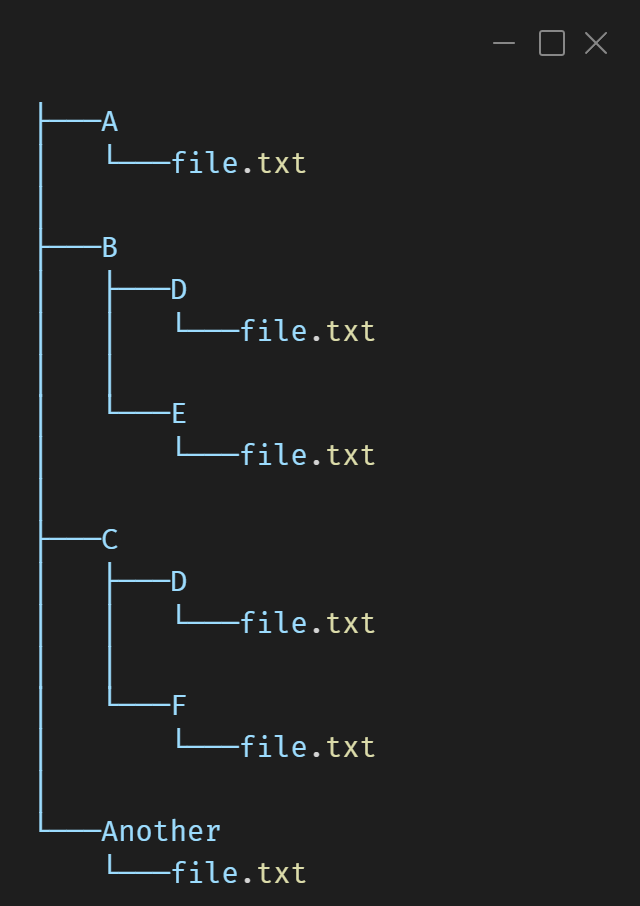

# fuzzily

An easy-to-use file fuzzy finder for vscode that works better the default file finder for navigating file structures with repeating file names. (at least for me it does)

## How to use

fuzzily add a keyboard shortcut `ctrl + shift + z` (or `cmd + shift + z` for those with lack of taste).
Alternatively use the comamnd pallete and search for *fuzzily: File Finder*

Example file structure:

You can use *fuzzily* like a normal file finder and search for `file.txt` however many results would come up and in now way it makes the life easier.

The true power of *fuzzily* comes when you are searching for a specific file and you roughly know the path to it.

### Examples
* when searching for `A/file.txt` the prompt should be ``a file`` (note that this tool is case insensitive and also matches results on substrings - no need to include the filename with extension and `Another/file.txt` is also included in the results)
* when searching for `B/D/file.txt` the prompt to return only that file is ``b d f``. The prompt ``d f`` returns `B/D/file.txt` and `C/D/file.txt`

## Extension Settings

This extension contributes the following settings:

* `fuzzily.resultLimit`: Sets max number of displayed results. (default: 20)

## Release Notes

### 1.0.0

Initial release of of *fuzzily*

---
## For more information

* [GitHub](https://github.com/matoussynek/fuzzily)

**Enjoy!**
